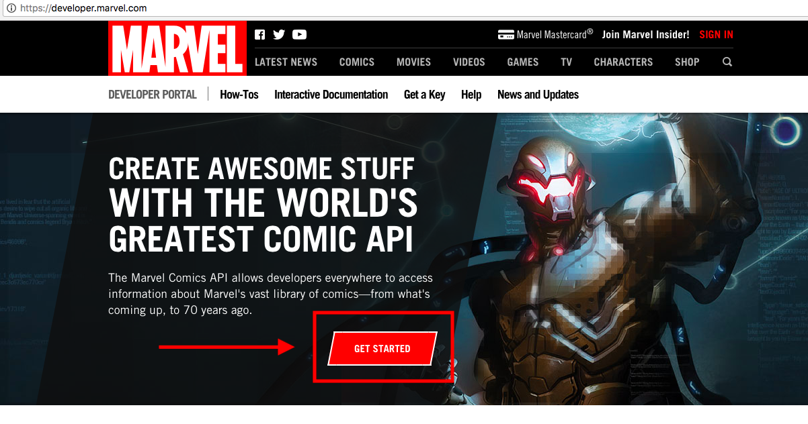
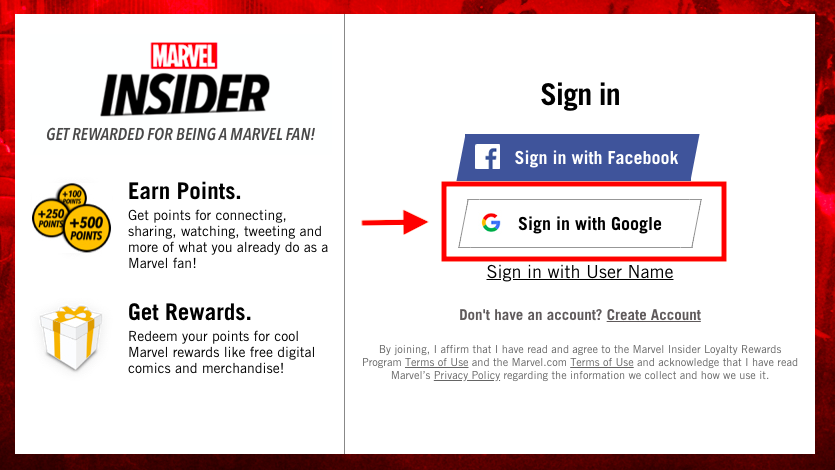
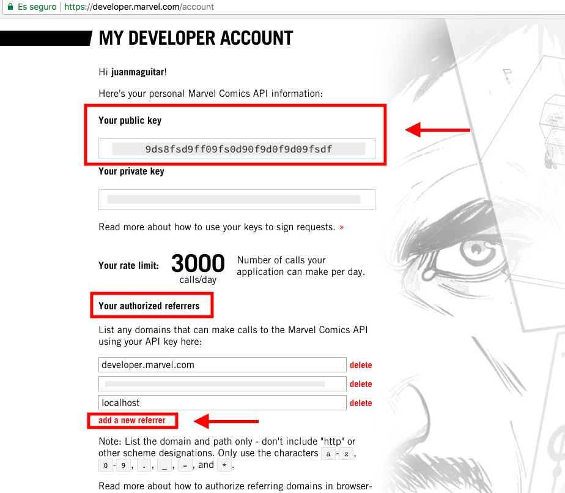
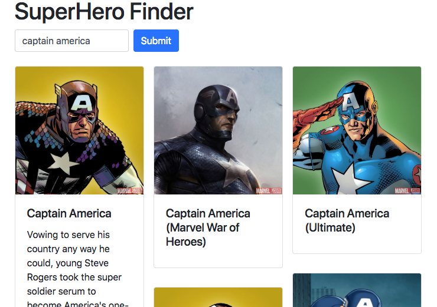

# Creando un servicio de consulta a la API de MARVEL

El concepto de **servicio** en programación web se utiliza para referenciar el código que encapsula la lógica de peticiones al servidor.
De esta manera se centralizan las peticiones relacionadas al servidor en un único sitio así como los métodos utilizados para comunicarse con el servidor.

Así, abstraemos al resto de nuestra aplicación del método utilizado para obtener (o enviar) datos del servidor. 

Nuestra aplicación le dirá al servicio algo así como...

> Oye, `ServiceApiMarvel` buscame esta `query` en el servidor utilizando tu método `searchSuperHero` y devuelveme los datos cuando los tengas. Aquí te dejo escrito ya lo que quiero que hagas con los datos cuando esten disponibles. Por cierto, no me importa cómo los consigas mientras lo que me devuelvas sea una promesa.

Estas peticiones al servidor que suelen ser asíncronas, suelen devolver un tipo de objeto llamado [promesa](https://developer.mozilla.org/es/docs/Web/JavaScript/Guide/Usar_promesas) con el que a través de su método [`.then()`](https://developer.mozilla.org/es/docs/Web/JavaScript/Referencia/Objetos_globales/Promise/then) podremos añadir lo que queremos hacer con los datos una vez los tengamos disponibles

Para hacer peticiones al servicio en esta versión utilizaremos el método nativo [`fetch`](https://developer.mozilla.org/en-US/docs/Web/API/Fetch_API/Using_Fetch) que devuelve una promesa

---

Pero vayamos por partes, primero necesitamos registrarnos en la _Developer Home Marvel_ para obtener los datos de acceso a su API

## Obteniendo la API Key y configurando los _Authorized Referrers_

Desde `https://developer.marvel.com/` le damos a _Get Started_ y nos llevará a una página para que nos podamos identificar como usuarios.



Nos logeamos por ejemplo con nuestra cuenta de Google



y accedemos a la página "My Developer Account" donde tendremos disponible info necesario para poder utilizar la API de MARVEL




#### Public Key

Nuestra _Public Key_ que nos hará falta para las peticiones a la API de Marvel

```
https://gateway.marvel.com/v1/public/characters?name=thanos&apikey=<%YOUR_PUBLIC_KEY%>
```

#### Authorized Referrers

Los _Authorized Referrers_ son los dominios desde los cuales podrás acceder a esta API. Asegurate de que al menos tienes añadido el dominio `localhost` para desarrollo en local

Si subes tu aplicación a la nube, asegurate de que el dominio en producción también esté añadido aqui (si publicas con [now](https://zeit.co/now), deberias añadir `now.sh`)

#### 3000 calls/day

El acceso a esta API es gratuito pero tiene un limite de 3000 peticiones al día. Tenlo en cuenta si después de un día de intenso trabajo con esta API empiezas a recibir mensajes de error en tus peticiones y no sabes por qué

## Creando el servicio 

Con estos datos ya podemos crear el servicio 

**`serviceApiMarvel.js`**
```
import { PUBLIC_KEY } from '../config.js'
const BASE_URL_API = "https://gateway.marvel.com/v1/public/"

const getUrlApiSearch = query =>
  `${BASE_URL_API}characters?nameStartsWith=${query}&apikey=${PUBLIC_KEY}`

export const searchSuperHero = query => {
  const url = getUrlApiSearch(query)
  return fetch(url)
    .then(response => response.json())
    .then(({ data: { results } }) => results)
}
```

Es una buena idea guardar la PUBLIC_KEY (y otras claves en general) en un archivo apart. Asi podemos crear un archivo `config.js` donde dejar escrita nuestra PUBLIC_KEY y añadir este archivo al `.gitignore` para que no suba al repositorio

```
├── js
│   ├── config.js
│   └── services
│       └── serviceApiMarvel.js
```

Por lo demás, el método `searchSuperHero` toma una query, genera una URL con ella, hace una request a esa URL y maneja la respuesta (en forma de promise) a traves de `.then` para devolverla lista para su uso directo

## Utilizando el servicio 

Con esta implementación ya podriamos utilizarla por ejemplo así...

```
<!DOCTYPE html>
<html lang="en">
<head>
  <meta charset="UTF-8">
  <title>Document</title>
</head>
<body>
  <script type="module">

    import { searchSuperHero } from "./js/services/serviceApiMarvel.js"

    const query = 'captain america'
    searchSuperHero(query)
      .then(results => {
        console.log(results)
      })
    
  </script>
</body>
</html>
```

Fijaros como en navegadores modernos ya podemos usar módulos ES2015. Para ello marcamos el `script` como `type="module"` y a partir de ahi ya podemos usar expresiones como 

```
    import { searchSuperHero } from "./js/services/serviceApiMarvel.js"
```

En https://github.com/juanmaguitar/heroFinder-frontApproaches/tree/master/jquery-demo tienes una aplicación basada en este servicio utilizando jQuery

La puedes ver online desde: https://jquery-demo-zcrzaettdo.now.sh/


